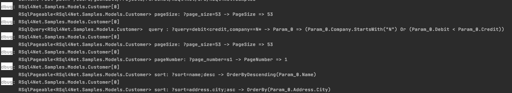

<p align="center">

</p>

[](https://github.com/gwendallg/rsql4net/blob/develop/LICENSE) [](https://www.nuget.org/packages/RSql4Net)

RSql4Net is a aspNet .net core extension that will make it easier for you to write your REST APIs. Its purpose is to convert a HTTP request who is in RSQL format to C# lambda expression.

## Continuous integration

| Branch                      |  Build | Quality Gate |
|-----------------------------|--------|--------------|
| master                      | | [](https://sonarcloud.io/dashboard?id=gwendallg_rsql4net&branch=master) |
| develop                     |  | | 

## Table of Contents

1. Installation

2. Quick start

3. Documentation

4. Samples

## Installation

```shell

dotnet add package RSql4Net

```

## Quick Start

1. Add the RSql4Net nuget package in your project.

2. In your project, modify the Startup.cs class to add the RSql extension

```csharp

    using RSql4Net;

    public class Startup
    {
        public void ConfigureServices(IServiceCollection services)
        {
            services
                .AddControllers()
                .AddRSql();
        }
    }

```

3. In your project, Add a new operation in your mvc controller

```csharp

    using RSql4Net.Models;
    using RSql4Net.Controllers;
    using RSql4Net.Models.Paging;
    using RSql4Net.Models.Queries;

    namespace MyNamespace
    {
        public MyController : Controller
        {

            private IList<MyModel> _myRepository;

            public MyController(IList<MyModel> myRepository) {
                _myRepository == myRepository ?? throw new ArgumentNullReferenceException(nameof(myRepository));
            }
            
            /// <summary>
            /// Get resource items by RSql Query and Pageable Query
            /// </summary>
            /// <param name="query"></param>
            /// <param name="pageable"></param>
            /// <returns></returns>
            [HttpGet]
            public IActionResult Get([FromQuery] IRSqlQuery<MyModel> query,[FromQuery] IRSqlPageable<MyModel> pageable)
            {
                // is not valid request
                if (!ModelState.IsValid)
                {
                    return BadRequest(new ErrorModel(ModelState));
                }

                // use the extension method from RSql4Net.Models.QueryableExtensions.cs
                var page = _myRepository
                    .AsQueryable()
                    .Page(pageable, query);
                // 200 OK : if result page contains all items from in repository
                // 206 Partial : if the result page contains a part of items from repository
                // use the extension method from RSql4Net.Controllers.ControllerBaseExtensions.cs
                return this.Page(page);
            }
            
        }
    }

```

## Documentation

<p align="center">

</p>

### Main components

#### IRSqlQuery or RSqlQuery

This objects define the RSql Query.

<p align="center">

</p>

| Operation |  Description |
|-----------|--------------|
| Value |  contains the Query string parameters converted to C# Lambda Expression.|

### IRSqlPageable, RSqlPageable and RSqlSort

These objects define the paging and sorting criteria to apply.

<p align="center">

</p>

#### IRSqlPageable, RSqlPageable

| Operation |  Description |
|-----------|--------------|
| PageSize | defined the size of page to return |
| PageNumber | defined the page number to return |
| Sort | contains the list of sorts to apply (see RSqlSort)|

#### RSqlSort

| Operation |  Description |
|-----------|--------------|
| Value | value of sort|
| IsDescending | defines if sort is descending or ascending |

### IRSqlPage and RSqlPage

<p align="center">

</p>


| Operation |  Description |
|-----------|--------------|
| TotalElements | total count of element returned by where clause |
| Number | current number page |
| NumberOfElement | count of elements in the current page |
| TotalPages | total count of pages |
| HasContent | does the current page contains elements ? |
| HasPrevious | does the current page have a previous page ? |
| HasNext | does the current page have a next page ? |

### Configuration

#### Customize query string parameter names

To change query string parameter names, you could modify the RSql configuration like the below sample.

```csharp

    using RSql4Net;

    public class Startup
    {
        public void ConfigureServices(IServiceCollection services)
        {
            services
                .AddControllers()
                .AddRSql(
                    options =>
                        options
                            // change the query string parameter name for RSql query field
                            .QueryField("q")
                            // change the query string parameter name for page size field
                            .PageSizeField("si")
                            // change the query string parameter name for page number field
                            .PageNumberField("of")
                            // change the default page size
                            .PageSize(50)
                );
        }
    }

```

#### How do you add a memory cache for RSql queries ?

To add a cache Memory to RSql queries, you could modify the RSql configuration like below sample.

```csharp

    using RSql4Net;

    public class Startup
    {
        public void ConfigureServices(IServiceCollection services)
        {
            // we create the RSql cache memory
            var memoryCache = new MemoryCache(
                new MemoryCacheOptions()
                {
                    SizeLimit = 1024
                }
            );

            services
                .AddRSql(
                    options =>
                        // we define the memory cache who is used for RSql queries
                        .QueryCache(memoryCache)
                        // we define a function who is invoked when register a new Rsql query in memory cache
                        .OnCreateCacheEntry((o) =>
                        {
                            o.Size = 1024;
                            o.SlidingExpiration = TimeSpan.FromSeconds(25);
                            o.AbsoluteExpirationRelativeToNow = TimeSpan.FromMinutes(5);
                        })
                );
        }
    }

```

#### How do you add RSql definition in SwaggerGen ?

To add a Swashbuckle OpenAPI support to RSql queries, you could modify the RSql configuration like the below sample.

```csharp

    using RSql4Net.SwaggerGen;

    public class Startup
    {
        public void ConfigureServices(IServiceCollection services)
        {
            services.AddSwaggerGen(c =>
                {
                // add supported to Rsql SwaggerGen Documentation
                c.OperationFilter<RSqlOperationFilter>();
                }
        }
    }

```

#### How do you log your RSql Queries ?

Update the appsettings.json file with debug level for RSql4net namespace

```json
{
  "Logging": {
    "LogLevel": {
      "RSql4Net":"Debug"
    }
  }
}
```

In the console ...

<p align="center">

</p>

#### How do you convert a RSql page To the other kind RSql page ?

```csharp

    using RSql4Net.Models.Paging;

    namespace RSql4Net.Samples
    {
        public class Customer {
        
            /// <summary>
            /// get of set LastName
            /// </summary>
            public string LastName {get; set; }
        
            /// <summary>
            /// Get or Set FirstName
            /// </summary>
            public string FirstName {get; set; }
        }

        public class CustomerDto
        {
            /// <summary>
            /// Get of Set Name
            /// </summary>
            public string Name { get; set; }
        }

        /// <summary>
        /// sample   
        /// </summary>
        public static class MyConversionHelper
        {
            public static IRSqlPage<CustomerDto> Convert(IRSqlPage<Customer> src)
            {
                //use "As" method on IRSqlPage<T>
                // and create your selector ...
                return src.As(
                    c => new CustomerDto() {Name = string.Concat(c.LastName, "", c.FirstName)});
            }
        }
    }

```

### Dockerization

To try sample, you can build docker build file. In the project directory ...


```shell

docker build -t rsql4net-sample:latest .
docker run -p 5001:5001 rsql4net-sample:latest -d 

```

go to http://localhost:5001/swagger

## RSql syntax

### The operators

| Binary operator||
|-|-|
|and| **;**|
|or| **,**|

| Comparison operator||
|-|-|
|equals|**==** or **=eq=**|
|not equals|**!=** or **=neq=**|
|lower than|**<** or **=lt=**|
|lower than or equals|**<=** or **=le=**|
|greater than|**>** or **=gt=**|
|greater than or equals|**>=** or **=ge=**|
|in|**=in=(,)**|
|not in| **=out=(,)**|
|is null|**=is-null='true\|false'** or **=nil='true\|false'**|

### Query examples

Examples of RSql expressions in both FIQL-like:

with customer json model like ,

```json
{
      "address": {
        "city": "Port Lenorefort",
        "street": "18304 Casper Trail",
        "country": "Palestinian Territory",
        "zipcode": "22270"
      },
      "birth_date": "2003-08-02T21:25:27.3902975+02:00",
      "company": "Hilll LLC",
      "email": "Elwin.Jenkins@gmail.com",
      "id": 1,
      "name": "West",
      "phone": "957.379.6587",
      "username": "Amalia.Stroman8",
      "website": "https://lou.name",
      "debit": 0.171063486566331,
      "credit": 0.5955531883964097
}
```

#### example n°1 : find all items with : name equal West AND debit > 0

**RSQL** : name==West;debit=gt=0

**Request URL** : https://localhost:5003/customers?query=name%3D%3DWest%3Bdebit%3Dgt%3D0

#### example n°2 : find all items with : address.city start with Pales OR name equals West or East

**RSQL** : address.city==Pales*,name=in=(West,East)

**Request URL** : https://localhost:5003/customers?query=address.city%3D%3DPales%2A%2Cname%3Din%3D%28West%2CEast%29

### Paging and sorting examples

#### example n°1 : find all items with : debit great than or equals to 0 AND i want the 2nd page with 50 items by page

**RSQL** : debit=ge=0&pageNumber=1&pageSize=50

**Request URL** : https://localhost:5003/customers?query=debit%3Dge%3D0&page_number=1&page_size=50

#### example n°2 : find all items with : debit great than or equals to 0 AND i want the first page with 50 items by page AND i sort ascending by name AND i sort descending by credit

**RSQL** : debit=ge=0&pageNumber=1&pageSize=50&sort=name;asc&sort=credit;desc

**Request URL** :  https://localhost:5003/customers?query=debit%3Dge%3D0&page_number=0&page_size=50&sort=name%3Basc&sort=credit%3Bdesc

## And ...

* See RSql4Net.Samples project for samples
* See https://github.com/jirutka/rsql-parser
* See http://tools.ietf.org/html/draft-nottingham-atompub-fiql-00
