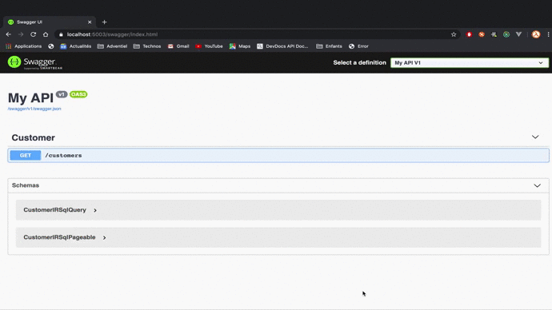

<p align="center">

</p>

[](https://github.com/gwendallg/rsql4net/blob/develop/LICENSE) []()

RSql4Net is AspNet Core extension that will make it easier for you to write your REST APIs. Its purpose is to convert a query in RSQL format to lambda expression.

## Continuous integration

| Branch                      |  Build | Quality Gate | Coverage |
|-----------------------------|--------|--------------|----------|
| master                      | | [](https://sonarcloud.io/dashboard?id=gwendallg_rsql4net&branch=master) | [](https://coveralls.io/github/gwendallg/rsql4net?branch=master) |
| develop                     |  | | [](https://coveralls.io/github/gwendallg/rsql4net?branch=develop) |

## Table of Contents

1. Installation

2. Quick start

3. Documentation

4. Samples

## Installation

```shell

dotnet add package RSql4Net

```

## Quick Start

1. Add the RSql4Ndt nuget package in your project.

2. In your project, modify the Startup.cs class to add the RSql Extension

```csharp

    public void ConfigureServices(IServiceCollection services)
    {
        ...
        services
            .AddControllers()
            .AddRSql();
        ...
    }

```

3. In your project, Add a new operation in your mvc controller

```csharp

    // like Get operation
    [HttpGet]
    public IActionResult Get([FromQuery] IRSqlQuery<MyModel> query,[FromQuery] IRSqlPageable<Model> pageable)
    {
        // the query parameters are correctly parsed ?
        if (ModelState.IsValid)
        {
            // your repository to filter
            IQueryable<MyModel> repository;

            // the C# expression from query string parsing
            var filter = query.Value();

            // your filtered repository
            var filteredData = repository.Where(filter);

            // create Http result response

            ...
        }
    }

```

or more simply, with use the extension method in ControllerBaseExtensions.cs to return a RSqlPage.

```csharp

    ...
    using RSql4Net.Models.Paging;
    using RSql4Net.Models.Queries;
    using RSql4Net.Samples.Models;
    using RSql4Net.Controllers;
    ...

    namespace MyNamespace
    {
        public class MyController : Controller
        {
            ...
            [HttpGet]
            public IActionResult Get([FromQuery] IRSqlQuery<MyModel> query,[FromQuery] IRSqlPageable<MyModel> pageable)
            {
                // the query parameters are correctly parsed ?
                if (!ModlState.IsValid)
                {
                    return BadRequest();
                }

                // your repository to filter
                IQueryable<MyModel> repository;

                //
                // OK:200 ( the page contains all results)
                // PartialContent:206 ( the page contains a part results)
                return this.Page(repository, pageable, query);
            }
            ...
        }
    }
```

## Documentation

<p align="center">

</p>

### Main components

#### IRSqlQuery or RSqlQuery

This objects define the RSql Query.

<p align="center">

</p>

| Operation |  Description |
|-----------|--------------|
| Value |  contains the Query string parameters converted to Lambda Expression.|

### IRSqlPageable, RSqlPageable and RSqlSort

These objects define the paging and sorting criteria to apply.

<p align="center">

</p>

#### IRSqlPageable, RSqlPageable

| Operation |  Description |
|-----------|--------------|
| PageSize | defined the size of page to return |
| PageNumber | defined the page number of page to return |
| Sort | contains the list of sorts to apply |

#### RSqlSort

| Operation |  Description |
|-----------|--------------|
| OrderBy | contains list of ascending sorts to apply |
| OrderDescendingBy | contains list of descending sorts to apply |

### IRSqlPage and RSqlPage

<p align="center">

</p>

| Operation |  Description |
|-----------|--------------|
| TotalElements | total number of items contained |
| Number | number page |
| NumberOfElement | number of items contained in page |
| TotalPages | total number of pages |
| HasContent | the current page contains items |
| HasPrevious | the current page has a previous page |
| HasNext | the current page has a next page |
| HasNext | contains of current page |

### Configuration

#### Customize query string parameter names

To change query string parameter names, you would modify the RSql configuration.

```csharp

    public void ConfigureServices(IServiceCollection services)
    {
        ...
        services
            .AddControllers()
            .AddRSql(
                options =>
                    options
                        // change the query string parameter name for RSql query field
                        .QueryField("q")
                        // change the query string parameter name for page size field
                        .PageSizeField("si")
                        // change the query string parameter name for page number field
                        .PageNumberField("of")
                        // change the default page size
                        .PageSize(50)
            );
        ...
    }
```

#### Add Memory cache for RSql queries

To add a cache Memory for RSql queries, you would modify the RSql configuration.

```csharp

    public void ConfigureServices(IServiceCollection services)
    {
        ...

        // create the memory cache
        var memoryCache = new MemoryCache(
            new MemoryCacheOptions()
            {
                SizeLimit = 1024
            }
        );

        services
            .AddRSql(
                options =>
                    // define the memory cache used for RSql queries
                    .QueryCache(memoryCache)
                    // invoked when register a new Rsql query in memory cache
                    .OnCreateCacheEntry((o) =>
                    {
                        o.Size = 1024;
                        o.SlidingExpiration = TimeSpan.FromSeconds(25);
                        o.AbsoluteExpirationRelativeToNow = TimeSpan.FromMinutes(5);
                    })
            );
        ...
    }
```

#### Add Rsql definition in SwaggerGen

To add a cache Memory for RSql queries, you would modify the RSql configuration.

```csharp

    public void ConfigureServices(IServiceCollection services)
    {
        ...
        services.AddSwaggerGen(c =>
            {
                ...
                // add supported to Rsql SwaggerGen Documentation
                c.OperationFilter<RSqlOperationFilter>();
                ...
            }
        ...
    }
```

## RSQL syntax

### The operators

| Binary operator||
|-|-|
|and| **;**|
|or| **,**|

| Comparison operator||
|-|-|
|equals|**==** or **=eq=**|
|not equals|**!=** or **=neq=**|
|lower than|**<** or **=lt=**|
|lower than or equals|**<=** or **=le=**|
|greater than|**>** or **=gt=**|
|greater than or equals|**>=** or **=ge=**|
|in|**=in=(,)**|
|not in| **=out=(,)**|
|is null|**=is-null='true\|false'** or **=nil='true\|false'**|

### Query examples

Examples of RSql expressions in both FIQL-like:

with customer json model like ,

```json
{
      "address": {
        "city": "Port Lenorefort",
        "street": "18304 Casper Trail",
        "country": "Palestinian Territory",
        "zipcode": "22270"
      },
      "birth_date": "2003-08-02T21:25:27.3902975+02:00",
      "company": "Hilll LLC",
      "email": "Elwin.Jenkins@gmail.com",
      "id": 1,
      "name": "West",
      "phone": "957.379.6587",
      "username": "Amalia.Stroman8",
      "website": "https://lou.name",
      "debit": 0.171063486566331,
      "credit": 0.5955531883964097
}
```

#### example n°1 : find all items with : **name** equal West and debit > 0**

**RSQL** : name==West;debit=gt=0

**Request URL** : https://localhost:5003/customers?query=name%3D%3DWest%3Bdebit%3Dgt%3D0

#### example n°2 : find all items with : **address.city** start with Pales% West or *name* equals West or East

**RSQL** : address.city==Pales*,name=in=(West,East)

**Request URL** : https://localhost:5003/customers?query=address.city%3D%3DPales%2A%2Cname%3Din%3D%28West%2CEast%29

### Paging and sorting examples

#### example n°1 : find all items with : **debit** great than or equals to 0 AND i want the 2nd page with 50 items by page

**RSQL** : debit=ge=0&pageNumber=1&pageSize=50

**Request URL** : https://localhost:5003/customers?query=debit%3Dge%3D0&page_number=1&page_size=50

#### example n°2 : find all items with : **debit** great than or equals to 0 AND i want the first page with 50 items by page AND i sort ascending by name AND i sort descending by credit

**RSQL** : debit=ge=0&pageNumber=1&pageSize=50&sort=name;asc&sort=credit;desc

**Request URL** :  https://localhost:5003/customers?query=debit%3Dge%3D0&page_number=0&page_size=50&sort=name%3Basc&sort=credit%3Bdesc

## And ...

* See RSql4Net.Samples project for samples
* See https://github.com/jirutka/rsql-parser
* See http://tools.ietf.org/html/draft-nottingham-atompub-fiql-00
